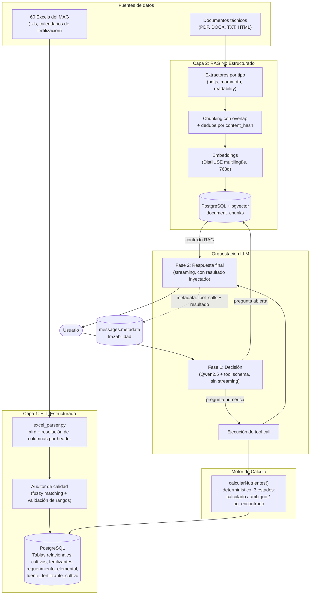
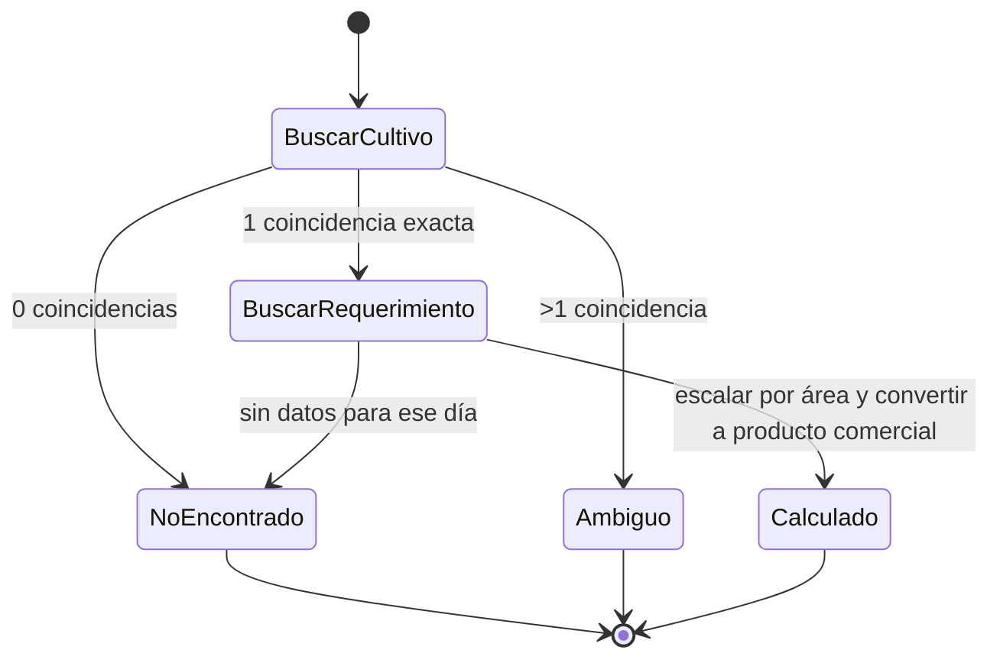

# Arquitectura de AgroBot: Sistema Híbrido de Extracción Estructurada, Recuperación Aumentada y Cálculo Determinístico

## 1. Resumen ejecutivo

AgroBot es un asistente conversacional para fertilización agrícola que combina **dos
arquitecturas de recuperación de información distintas**, seleccionadas según el tipo
de conocimiento que cada pregunta requiere:

1. **Extracción-Transformación-Carga (ETL) + invocación de herramientas (tool-calling)**
   para preguntas que requieren un cálculo numérico exacto (dosis de fertilizante).
2. **Generación Aumentada por Recuperación (RAG)** con embeddings vectoriales para
   preguntas de conocimiento agronómico abierto (síntomas, manejo, recomendaciones
   generales).

La decisión de cuál ruta usar en cada mensaje **la toma el modelo de lenguaje mismo**,
mediante function calling nativo, no una regla de enrutamiento escrita a mano — el LLM
decide invocar la herramienta de cálculo cuando la pregunta lo amerita, y responde
directamente desde el contexto RAG cuando no.

Esta arquitectura híbrida existe porque los modelos de lenguaje son buenos generando
texto coherente pero **no son fiables haciendo aritmética exacta sobre datos que leyeron
como texto** — un LLM puede alucinar un número aunque el texto fuente sea correcto. La
decisión de diseño central del proyecto fue: **ningún cálculo numérico debe depender de
que el LLM "lea bien" un número de un fragmento de texto recuperado.**

---

## 2. Diagrama de arquitectura general



---

## 3. Capa 1: ETL estructurado

### 3.1 Por qué no es RAG

Es importante para la defensa de esta tesis dejar clara la distinción terminológica: esta
capa **no usa embeddings ni búsqueda por similitud semántica**. Los datos de fertilización
(dosis, requerimientos elementales) se extraen a tablas relacionales y se consultan con
SQL exacto. Cuando el sistema necesita "la dosis de Urea para tomate en el día 30", ejecuta
una consulta `WHERE` sobre columnas indexadas — no busca el fragmento de texto más parecido
semánticamente. Llamar RAG a esta capa sería impreciso frente a un jurado familiarizado con
arquitecturas de IA.

### 3.2 Las cuatro garantías de diseño

| Garantía | Mecanismo | Evidencia |
|---|---|---|
| **Normalización uniforme** | Resolución de columnas por nombre de encabezado (no por posición fija), con fuzzy matching como respaldo | Café usa `CaO`, otros usan `Ca` — ambos se resuelven al mismo campo sin intervención manual |
| **Filtrado anti-ruido** | Los datos administrativos (Productor, Finca, Técnico) viven en un bloque de encabezado separado de la tabla de datos, nunca se mezclan | Validado contra 8 estructuras de Excel distintas |
| **Rendimiento** | Índices B-tree sobre `(cultivo_id, dia_despues_siembra)` y `nombre` | — |
| **Idempotencia** | Transacción `DELETE ... WHERE fuente_archivo = X` + `INSERT`, por archivo de origen | Prueba real: 2 corridas consecutivas produjeron exactamente 12,469 filas en ambas |

### 3.3 Un hallazgo de diseño que cambió el plan original

El plan inicial asumía que la clave natural de un "cultivo" era su nombre (`"Piña"`,
`"Tomate"`). Al procesar los 60 archivos reales se descubrió que **el mismo nombre visible
puede corresponder a programas de fertilización genuinamente distintos** — ej. tres
archivos de Piña (estándar, Prueba Media, Prueba Monty Farms) representan tres realidades
agronómicas diferentes, no la misma información duplicada.

La corrección de diseño fue mover la clave de idempotencia del **nombre** al **archivo de
origen** (`fuente_archivo`), y enseñarle al motor de cálculo a **nunca adivinar** cuál
programa usar cuando hay más de una coincidencia — en su lugar, devuelve un estado
`ambiguo` con las opciones disponibles para que el usuario elija. Esto se validó con
evidencia real: la pregunta *"fertilizar piña"* produjo una lista de 3 opciones con su
archivo de origen, en vez de una respuesta arbitraria.

### 3.4 Límite de diseño documentado: sin ajuste por tipo de suelo

Los Excels del MAG incluyen una sección "Análisis de suelos" (Mehlich-1: fósforo, potasio,
magnesio, calcio en ppm, traducidos a un porcentaje de fertilización a aplicar). Al
inspeccionar los 8 archivos de muestra, se encontró que **estos valores son idénticos en
todos los archivos** ("Muy Bajo", mismos ppm) — es el valor por defecto de la plantilla
cuando nunca se hizo un análisis de suelo real, no dato agronómico verdadero.

Decisión tomada: el sistema no aplica ajuste por tipo de suelo (**Opción A**), y lo declara
explícitamente en cada respuesta de cálculo (`advertencias: ["Esta recomendación no incluye
ajuste por tipo de suelo..."]`). El mecanismo real de ajuste (ppm → estatus → % de
fertilización) queda documentado como hallazgo de diseño para una implementación futura con
datos de suelo reales del usuario, en vez de inventar un factor de corrección sin respaldo.

---

## 4. Capa 2: RAG no estructurado

### 4.1 Alcance de formatos soportados

| Formato | Extractor | Estado |
|---|---|---|
| PDF con texto | `pdfjs-dist` | ✅ Activo (16 documentos, 5,166 chunks) |
| Word (.docx) | `mammoth` | ✅ Infraestructura lista |
| Texto plano (.txt/.md/.csv) | lectura directa | ✅ Infraestructura lista |
| HTML / artículos web | `@mozilla/readability` + `jsdom` | ✅ Infraestructura lista |
| PDF escaneado (imagen) | — | ❌ Fuera de alcance (requiere OCR) |

La decisión de no implementar OCR especulativamente, sin confirmar que el corpus real lo
necesita, es intencional — cada extractor agregado es una dependencia adicional que
mantener; se agrega bajo demanda, no por anticipación.

### 4.2 Chunking y deduplicación

Los documentos se dividen en fragmentos de ~800 caracteres con solapamiento de 100
caracteres (para no perder contexto en el límite entre fragmentos), respetando límites de
palabra. Cada documento se identifica por el **hash SHA-256 de sus bytes crudos**,
calculado *antes* de cualquier procesamiento — esto permite omitir el reprocesamiento
completo de un archivo ya ingerido (verificado: 18 PDFs, segunda corrida, 0 reprocesados)
en vez de descubrir la duplicación después de haber hecho el trabajo costoso de extracción.

### 4.3 Decisión de modelo de embeddings y su limitación documentada

Se usa `distiluse-base-multilingual-cased-v2` vía Transformers.js (Xenova), con mean
pooling y normalización L2. Verificación empírica confirmó una salida de 768 dimensiones.
Es importante documentar con precisión qué representa este vector: el modelo oficial de
sentence-transformers proyecta su salida de 768 a 512 dimensiones mediante una capa Dense
entrenada específicamente para similitud semántica; el port de Xenova a ONNX expone la
salida *previa* a esa proyección. Es decir, el sistema usa el vector promedio de
DistilBERT multilingüe, no el embedding oficial optimizado del modelo completo — una
decisión de diseño válida (compatible con la columna `vector(768)` existente) pero que
debe declararse explícitamente, no presentarse como el embedding "estándar" del modelo.

### 4.4 Auditoría de saneamiento vectorial: eliminación de contaminación numérica

Durante la fase de auditoría del espacio vectorial en PostgreSQL (`document_chunks`), se detectó que existían **30,090 fragmentos residuales** etiquetados como `chunk_type = 'data'`, generados por versiones tempranas del ingestor antes de desacoplar los datos tabulares.

Para evitar que el LLM recuperara fragmentos numéricos descontextualizados durante la búsqueda por similitud semántica (reintroduciendo el riesgo de alucinación aritmética), se ejecutó una purga dirigida:

```sql
DELETE FROM document_chunks WHERE metadata->>'chunk_type' = 'data';
```

**Resultado verificado post-purga:**
- **30,090 chunks numéricos eliminados.**
- **5,680 chunks vectoriales limpios preservados** (5,166 de guías técnicas en PDF + 514 resúmenes narrativos de catálogo de fertilizantes).
- **0 documentos huérfanos** en la tabla `documents`.

---

## 5. Motor de cálculo determinístico

### 5.1 Máquina de estados

`calcularNutrientes()` nunca devuelve un número sin contexto de confianza — siempre uno de
tres estados explícitos:



### 5.2 Validación empírica de los tres estados

| Caso de prueba | Estado devuelto | Resultado observado |
|---|---|---|
| "Tomate 3000-Gavetas Invierno, 2 ha, día 30" | `calculado` | 5 productos con cantidades exactas |
| "Tomate, 2 ha, día 30" (nombre ambiguo entre 4 variantes) | `ambiguo` | Listó las 4 opciones con su archivo de origen; el LLM preguntó cuál usar en vez de elegir |
| "Piña, 1 manzana" (sin día del ciclo) | tool **no invocada** | El LLM preguntó la etapa del cultivo antes de intentar calcular — comportamiento reforzado en la descripción del tool, no en el schema |
| "Papa, 2 ha, día 20" (control negativo contra colisión con "Papaya") | `calculado` | Coincidencia exacta de "Papa"; "Papaya" quedó excluida correctamente por el criterio de match (igualdad o prefijo con espacio, no substring libre) |
| "Mango" (cultivo no ingerido) | `no_encontrado` | Mensaje honesto, sin número inventado |

### 5.3 Un error de correspondencia de nombres encontrado y corregido

Durante la integración con el LLM se detectó que una coincidencia por substring sin
restricciones (`ILIKE '%Papa%'`) haría match tanto con `"Papa"` como con `"Papaya"` — dos
cultivos completamente distintos. Se corrigió a una coincidencia de igualdad exacta o de
prefijo delimitado por espacio (`ILIKE 'Papa' OR ILIKE 'Papa %'`), validado con evidencia
real de que el control negativo (`"Papa"` sin match hacia `"Papaya"`) funciona.

---

## 6. Integración con el LLM: tool calling en dos fases

El modelo usado (`qwen2.5:7b` vía Ollama) tiene soporte nativo de function calling. La
integración requirió separar la llamada en dos fases, porque el streaming de Ollama no
permite leer `tool_calls` de forma confiable en tiempo real:

1. **Fase de decisión** (sin streaming): se envían los mensajes + el schema del tool. Si el
   modelo decide invocar `calcular_nutrientes`, se ejecuta la función determinística contra
   PostgreSQL y el resultado se inyecta de vuelta como mensaje `role: "tool"`.
2. **Fase de respuesta final** (con streaming): se genera la respuesta en lenguaje natural
   que ve el usuario, ya con el resultado exacto disponible en el contexto — el modelo
   narra el número, no lo calcula.

### 6.1 Trazabilidad para auditoría

Cada mensaje del asistente persiste en `messages.metadata` el `tool_calls` completo y el
`resultado` de la función cuando hubo cálculo, y `null` cuando la respuesta vino
puramente de RAG. Esto permite una consulta de auditoría directa:

```sql
SELECT
  COUNT(*) FILTER (WHERE metadata IS NOT NULL) AS respuestas_con_calculo_exacto,
  COUNT(*) AS total_respuestas
FROM messages WHERE role = 'assistant';
```

---

## 7. Enrutamiento híbrido: evidencia empírica

No existe una regla de enrutamiento escrita a mano — la decisión de cuándo usar el motor
de cálculo y cuándo responder desde el contexto RAG **la toma el tool-calling nativo del
LLM**. Se validó con dos casos reales:

| Pregunta | ¿Invocó el tool? | `messages.metadata` |
|---|---|---|
| "Necesito fertilizar 2 hectáreas de papa para el día 20" | Sí | `{tool_calls: [...], resultados: [...]}` |
| "¿Por qué las hojas de mi tomate se están poniendo amarillas?" | No | `null` |

---

## 8. Limitaciones conocidas (trabajo futuro)

1. **Sin ajuste por tipo de suelo** — mecanismo real identificado (Mehlich-1 → estatus →
   % de fertilización) pero sin datos reales de suelo por parcela; requiere que el usuario
   aporte su propio análisis.
2. **Tipo de riego fijo por cultivo** — los datos fuente asumen riego por goteo; el sistema
   avisa explícitamente cuando el usuario solicita un tipo de riego no soportado por los
   datos, en vez de calcular igual.
3. **Embeddings pre-proyección** — ver sección 4.3.
4. **Sin OCR** — documentos escaneados quedan fuera de alcance hasta confirmar necesidad
   real en el corpus.
5. **Detección de cultivo en documentos por lista de keywords** — independiente de la
   tabla `cultivos` de 60 nombres reales ya cargada; podría unificarse en trabajo futuro.

---

## 9. Resumen de evidencia recolectada durante el desarrollo

- 60/60 archivos Excel cargados correctamente tras corrección de idempotencia por archivo de origen.
- 12,469 filas de requerimiento elemental, 82 fertilizantes en catálogo, 318 mapeos producto-elemento.
- Prueba de idempotencia repetida (2 corridas consecutivas, conteo idéntico).
- Auditoría y purga vectorial: 30,090 fragmentos tabulares viejos eliminados, preservando 5,680 chunks limpios (5,166 PDF + 514 catálogo narrativo) con 0 documentos huérfanos.
- 5,166 chunks vectorizados desde PDFs, con deduplicación por hash verificada (segunda corrida: 18/18 omitidos sin reprocesar).
- 4 casos de prueba del motor de cálculo, cubriendo los 3 estados de la máquina de estados.
- 2 casos de prueba del enrutamiento híbrido, con evidencia directa de `messages.metadata`.
